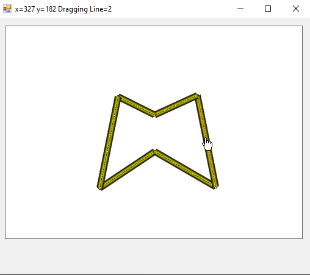

# PolyLine

C# WinfForms solution to calculating offset polylines based on point and line homogeneous coordinates.

### Screenshot



### Code

Using homogeneous coordinates for points and lines which make finding the inersections easier.

The magic happens in a function `Offset()` part of the `SegmentList` class

```
public SegmentList Offset(float distance)
{
    List<Line2> new_lines=new List<Line2>();
    int N=lines.Count;
    // Take each line and offset by distance, and store in
    // new list
    for (int i=0; i<N; i++)
    {
        Line2 offset_line=lines[i].Line.Offset(distance);
        new_lines.Add(offset_line);
    }
    List<LineSeg> result=new List<LineSeg>();
    for (int i=0; i<N; i++)
    {
        // i-th line
        Line2 this_line=new_lines[i];
        // Find index of previous line. If i-th is fist line,
        // the j points to last line
        int j=i>0?i-1:N-1;
        // Find index to next line. If i-th is the last line,
        // then k points to fist line
        int k=i<N-1?i+1:0;
        Line2 prev_line=new_lines[j];
        Line2 next_line=new_lines[k];
        // Trim infinate line based on intersection with
        // previous and next line.
        LineSeg offset_seg=this_line.TrimBetween(prev_line, next_line);
        result.Add(offset_seg);
    }
    // Create new polyline from array of line segments
    return new SegmentList(result.ToArray());
}
```

For each line segment it calls `Line.Offset()` first and then it finds the previous and next lines. It uses that to call `.TrimBetween()` that trims the ends on the line according to the infinite line of these sourounding segments.

The `.Offset(d)` method modifies the `(a,b,c)` parameters of an infinite line into `(a,b,c + d*√(a^2+b^2))` this modifies the distance parameter `c` by moving it the amount specified by `d`.

The `.TrimBetween(p,q)` method computes the coordinates of the intersection between the offset line and the previous offset line `p` and also the offset line and the next offset line `q` and defines the line segment between those two intersections.
